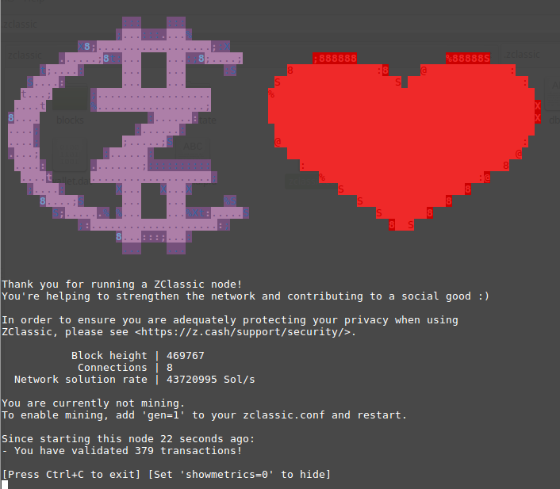

ZClassic 2.0.6-1

===========

What is ZClassic?
--------------

[ZClassic](https://zclassic.org/) is an implementation of the "Zerocash" protocol.
Based on Bitcoin's code, it intends to offer a far higher standard of privacy
through a sophisticated zero-knowledge proving scheme that preserves
confidentiality of transaction metadata. Technical details are available
in our [Protocol Specification](https://github.com/zcash/zips/raw/master/protocol/protocol.pdf).

This software is the ZClassic client. It downloads and stores the entire history
of ZClassic transactions; depending on the speed of your computer and network
connection, the synchronization process could take a day or more once the
blockchain has reached a significant size.

<p align="center">
  
</p>

#### :lock: Security Warnings

See important security warnings on the
[Security Information page](https://z.cash/support/security/).

**ZClassic is experimental and a work-in-progress.** Use at your own risk.

####  :ledger: Deprecation Policy

This release is considered deprecated 16 weeks after the release day. There
is an automatic deprecation shutdown feature which will halt the node some
time after this 16 week time period. The automatic feature is based on block
height.

## Getting Started

### Building

Build ZClassic along with most dependencies from source by running:


Clone the repository
```{r, engine='bash'}
git clone https://github.com/ZclassicCommunity/zclassic.git
cd zclassic
git checkout v2.0.6-1
```

 Get dependencies
```{r, engine='bash'}
sudo apt-get install \
build-essential pkg-config libc6-dev m4 g++-multilib \
autoconf libtool ncurses-dev unzip git python python-zmq \
zlib1g-dev wget curl bsdmainutils automake
```

 Install
```{r, engine='bash'}
# Build
./zcutil/build.sh -j$(nproc)
# fetch key
./zcutil/fetch-params.sh
```

Before running the ZClassic daemon, you need to create a configuration file `zclassic.conf` in `~/.zclassic`. Here's an example.
```
gen=0
equihashsolver=tromp
listenonion=0
```

Run
```{r, engine='bash'}
./src/zclassicd
```

Currently only Linux is officially supported.

License
-------

For license information see the file [COPYING](COPYING).
